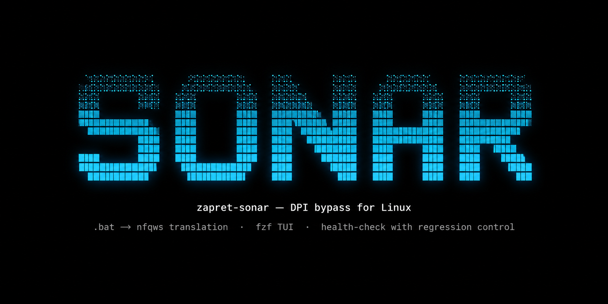
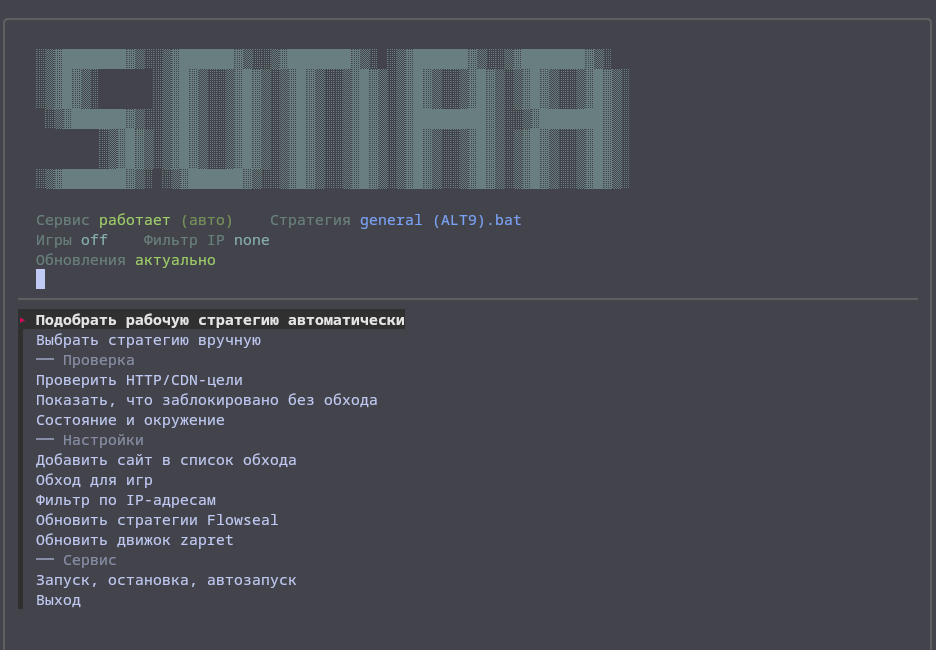
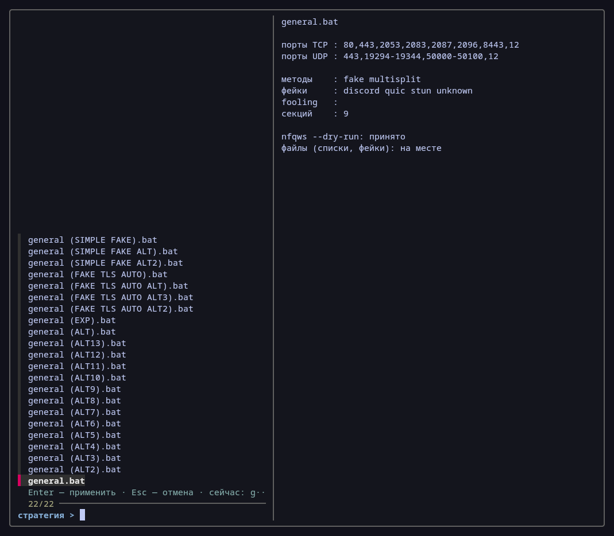
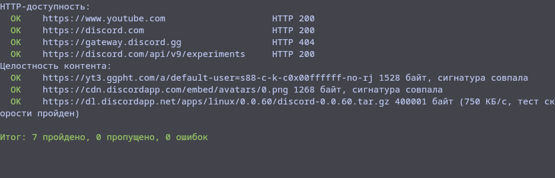
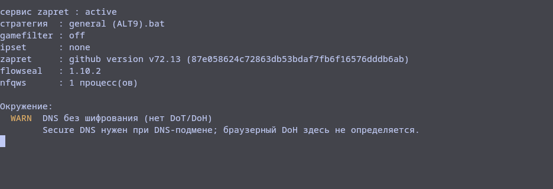

# zapret-sonar

<p align="center">
  
</p>

Linux-обёртка над [zapret](https://github.com/bol-van/zapret) v1 со стратегиями [Flowseal](https://github.com/Flowseal/zapret-discord-youtube). Трансляция `.bat`-стратегий Flowseal в аргументы `nfqws` для Linux — без Wine, без ручной конвертации.

## Что это

Flowseal публикует стратегии обхода DPI как `.bat`-файлы для Windows. zapret-sonar переводит их в аргументы `nfqws` и управляет жизненным циклом: установка, выбор стратегии, проверка, перебор, обновление.

```bash
sonar list              # список стратегий (* — применённая)
sonar use alt12         # применить стратегию (по части имени)
sonar try               # перебрать все, показать рабочие
sonar check             # работает ли обход сейчас
sonar status            # состояние сервиса, версии, окружения
sonar update            # обновить стратегии Flowseal
sonar upgrade           # обновить движок zapret (nfqws)
```

## Установка

```bash
git clone https://github.com/oxygen-syndata/zapret-sonar.git
cd zapret-sonar
sudo ./install.sh
```

Установщик скачивает zapret v1 (bol-van) и стратегии Flowseal, проверяет sha256 бинарников, ставит systemd-юнит и сам zapret-sonar в `/opt/zapret/`.

**Требования:** bash 4+, curl, tar, sha256sum, systemd, nftables (или iptables), fzf (для TUI — опционально).

**Тестировалось на:** CachyOS (Arch, x86_64), Ubuntu Server 26.04 LTS (x86_64). Должно работать на любом Linux с systemd и nftables.

## Как это работает

```
.bat Flowseal  →  translate.sh  →  NFQWS_OPT  →  config  →  systemctl restart
                                      ↓
                              nfqws --dry-run (валидация)
```

1. **Трансляция** — `lib/translate.sh` парсит `.bat`, извлекает аргументы `nfqws`, адаптирует пути (Windows → Linux), переводит CRLF.
2. **Санитизация** — результат проверяется на shell-метасимволы (конфиг исполняется через `.` от root).
3. **Валидация** — `nfqws --dry-run` разбирает аргументы своим парсером до записи конфига.
4. **Запись** — конфиг собирается атомарно (mktemp + mv), с маркерами состояния.
5. **Перезапуск** — `systemctl restart zapret`.

## Команды

| Команда | Описание |
|--------|----------|
| `list` | Список стратегий (`*` — применённая) |
| `use <стратегия>` | Применить (можно частью имени: `use alt12`) |
| `status` | Сервис, стратегия, версии zapret/Flowseal, окружение |
| `check` | Работает ли обход (HTTP-проверка заблокированных ресурсов) |
| `try [--keep]` | Перебрать все стратегии, показать рабочие. С контролем регрессии: стратегия, снявшая блокировку, но сломавшая работавшие сайты, рабочей не считается. `--keep` — оставить первую заработавшую |
| `baseline` | Что заблокировано БЕЗ обхода (сервис останавливается на время замера) |
| `update [--force]` | Обновить стратегии, списки и `.bin` из GitHub Flowseal |
| `upgrade [--force]` | Обновить движок zapret (nfqws, ip2net, mdig) с проверкой sha256 |
| `uninstall` | Полное удаление (сервис, юнит, файлы, симлинки) |
| `gamefilter [режим]` | `off\|tcp\|udp\|both` — обход для игр (порты >1023) |
| `ipset [режим]` | `none\|any\|loaded` — фильтр по IP из `ipset-all.txt` |
| `site <домен>` | Добавить домен в `list-general-user.txt` |
| `site --list` | Показать список доменов |
| `site --remove <домен>` | Удалить домен из списка |
| `start\|stop\|restart` | Управление сервисом |
| `enable\|disable` | Автозапуск сервиса |
| `--debug` | Подробный вывод (трейс, verbose curl) |
| `--version` | Версия |

## TUI

Интерактивный интерфейс на fzf: выбор стратегии с preview, проверки, настройки.

```bash
sonar-tui    # или zapret-sonar-tui
```









TUI проверяет обновления при запуске: в шапке видно, актуальны ли стратегии и движок. Обновление — вручную, кнопками в меню.

## Обновления

При запуске CLI/TUI проверяется наличие новых версий Flowseal и zapret. Проверка идёт в фоне, не блокирует работу — результат кэшируется на час. Обновление остаётся за пользователем:

```bash
sudo sonar update     # обновить стратегии Flowseal
sudo sonar upgrade    # обновить движок zapret
```

CLI показывает уведомление после выполнения команды, если есть обновление. TUI показывает статус в шапке.

## Отладка

```bash
sonar --debug check    # трейс команд, verbose curl
sonar --debug use alt9 # детальный вывод трансляции и применения
```

## Безопасность

- **Конфиг исполняется через `.` от root** — поэтому генерируется целиком из транслированной стратегии и проверяется на shell-метасимволы. Пользовательский ввод в конфиг не попадает.
- **sha256** — бинарники zapret сверяются с `sha256sum.txt` из релиза. У Flowseal sha256-файла нет — доверяем TLS.
- **Файлы в `/opt` принадлежат root** — записываемый пользователем бинарник, запускаемый от root, это готовая эскалация.
- **sudoers не трогается** — пароль спрашивается штатным sudo, NOPASSWD намеренно нет.
- **Бэкапы** — перед каждым обновлением nfqws старые бинарники копируются в `.bak/`; при ошибке сервиса — автооткат.

## Ограничения

Инструмент честен о том, что он не делает:

- **YouTube-троттлинг не измеряется.** `www.youtube.com` отвечает HTTP 200 без обхода — блокируется не домен, а троттлинг `googlevideo.com`. Проверка доступа к YouTube не означает, что видео не тормозит.
- **Discord Voice (UDP) не тестируется.** Голосовые серверы Discord на UDP 50000–50100 + STUN. curl не работает по UDP. «Discord работает» = текст работает, голос может не работать.
- **QUIC (HTTP/3) не тестируется.** Браузеры ходят на YouTube по HTTP/3. curl по умолчанию — по TCP/TLS.
- **ClientHello curl меньше браузерного.** Браузеры шлют постквантовый key share (~1800 байт, два TCP-сегмента). Стратегия может «работать» по curl и не работать в браузере.
- **IPv6 отключён.** `DISABLE_IPV6=1` в конфиге. Если у провайдера рабочий IPv6, трафик YouTube/Google по v6 идёт мимо nfqws. Preflight предупреждает об этом.

Для глубокого подбора стратегий по протоколам (TLS 1.2/1.3/QUIC) используйте `blockcheck.sh` из zapret (лежит в `/opt/zapret/`).

## Структура

```
zapret-sonar              CLI (главный скрипт)
zapret-sonar-tui          TUI на fzf
install.sh                Установщик
lib/translate.sh          Парсер .bat → NFQWS_OPT
lib/zconfig.sh            Генерация конфига, state-маркеры, ipset-режимы
lib/health.sh             Health-check, preflight, baseline/scoring
```

## Благодарности

- [bol-van/zapret](https://github.com/bol-van/zapret) — движок обхода DPI
- [Flowseal/zapret-discord-youtube](https://github.com/Flowseal/zapret-discord-youtube) — стратегии

## Troubleshooting

### Ни одна стратегия не работает

1. Проверьте Secure DNS: `sonar status` → в окружении не должно быть `WARN DNS без шифрования`. DoT/DoH обязателен — без него провайдер видит и подменяет DNS-запросы, и стратегии врут.
2. Проверьте туннели: `sonar status` → если активны `tun*`/`wg*`/`awg*`, трафик может идти мимо nfqws. Остановите VPN перед проверкой.
3. Проверьте IPv6: `sonar status` → если активен IPv6, трафик YouTube/Google идёт мимо nfqws (конфиг задаёт `DISABLE_IPV6=1`).
4. Запустите `sudo sonar try` — перебор всех стратегий с контролем регрессий.

### Discord работает, но голос нет

Голосовые серверы Discord используют UDP 50000–50100 + STUN. Health-check `sonar check` тестирует только TCP/HTTP — голос не проверяется. Это известное ограничение. Если текст работает, а голос нет — проблема в UDP-блокировке, стратегию нужно подбирать под UDP (gamefilter).

### try ничего не нашёл

1. Убедитесь, что baseline показал заблокированные цели: `sonar baseline` (при остановленном сервисе).
2. Если ни одна цель не заблокирована — перебор бессмысленен. Возможно, у провайдера другой механизм блокировки (DNS, IPv6).
3. Используйте `blockcheck.sh` из zapret (в `/opt/zapret/`) — он перебирает параметры по протоколам TLS 1.2/1.3/QUIC и выдаёт готовую команду.
4. Проверьте, что Secure DNS включён (DoT/DoH в настройках системы или роутера).

### После обновления nfqws сервис не поднимается

`sonar upgrade` автоматически откатывается к старым бинарникам при ошибке. Если откат не помог:
```bash
sudo sonar upgrade --force   # переустановит nfqws
```

### Как откатить стратегию к исходному конфигу zapret

При первом применении стратегии сохраняется оригинальный конфиг:
```bash
sudo cp /opt/zapret/config.orig /opt/zapret/config
sudo systemctl restart zapret
```

### Что удаляет uninstall

Сервис (stop + disable), systemd-юнит, nftables-таблица `inet zapret`, симлинки (`zapret-sonar`, `sonar`, `zapret-sonar-tui`, `sonar-tui`), рабочая директория `/opt/zapret`. config.orig восстанавливается перед удалением каталога.

## Лицензия

MIT
